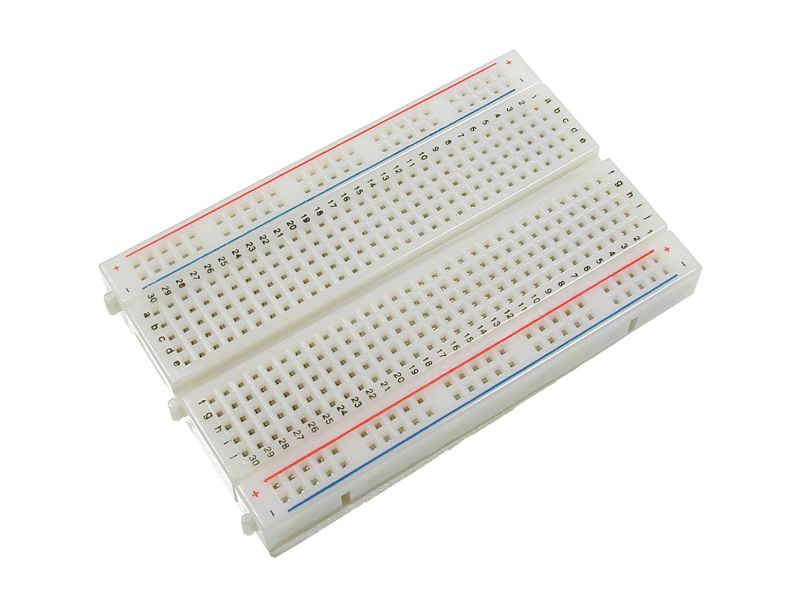

# TempHumi

Sensor of *temperature* and *humidity* using `micropython`.

## Ingredients

### NodeMCU (ESP8266)


### DHT22


### Protoboard



### Cables

- Cables to connect components (blue, red, and black).
- MicroUSB to USB cable to connect NodeMCU with PC.

## Scheme

 

## Picture

 

## Usage

On the PC:

```bash
$ cp config.tmpl.py config.py
# set your own values
$ pip install -r requirements.txt
$ make deploy
$ make
```

On the NodeMCU:

```python
>>> import temphumi
>>> temphumi.run()
```

## Tracking

Data is logged into [dweet.io](http://dweet.io/):

 

Depending on your "thing" name, you get different url, but, just to show the behaviour, you can check my data: http://dweet.io/follow/sdelquin
